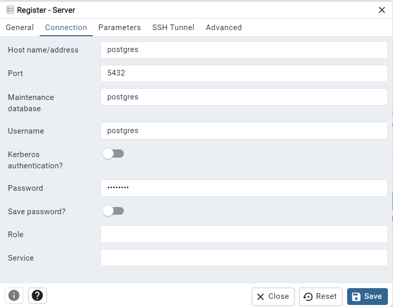

<strong>Internship Interview</strong>

ETL with Web scraping project with Pythin3, PostgreSQL, Docker

This is an End-to-End ETL Data Analytics project, that scraps Events Data from the link https://www.lucernefestival.ch/en/program/summer-festival-24 .

Tech Stacks used :

Python - Python is used in Data Extraction and Transformation
PostgreSQL is used to Design the Database Schema, Load the Data into Database

Public DockerHub link  -  https://hub.docker.com/repository/docker/akash270/event-scraper/general

**Step - 1 - Please clone my GitHub Repo  
Step - 2 - Change the directory to 'dockerised-scraper' folder   
Step - 3 - Pull the Docker Image   **

**1. To pull the image, Please run docker pull akash270/event-scraper:latest  
2. After that please run the docker-compose.yaml file by docker-compose -f docker-compose.yaml up -d  
3. on your favourite browser open localhost:5000, and login with email_id = admin@admin.com , password = admin  
4. Then you have to register the server with the below Database Credentials  
 
a. host address = postgres  
b. username = postgres  
c. Password = postgres  **

**If you face any issues in running the docker please do reach out to my Linkedin https://www.linkedin.com/in/akash-biswas/**

      

